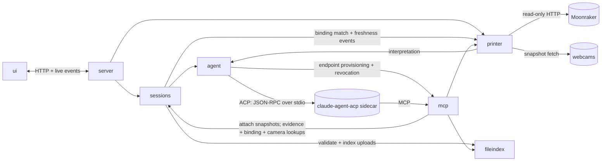

# Filamentary — Architecture

## Decisions needed from you

This section holds only open items — a topic that is absent is settled and recorded in `engineering/decisions.md`, not forgotten.

**No open decisions.**

Changes since last approval: none — this version was approved on 2026-08-08.

## 1. Modules

- **`ui`** — TypeScript browser app: phone-first session UI per `brand/design-language.md`.
- **`server`** — HTTP server: configuration loading (e.g. the printer-document location option, surfacing an unset one), serves the UI, session/printer APIs, live event fan-out to every connected device, startup URL + QR printing, the service log at a documented path, structured failure surfacing (R10).
- **`sessions`** — session lifecycle and store: evidence intake and validation (images itself; `.3mf` and gcode via `fileindex`), transcripts, upload identifiers, local name derivation, search, archive/unarchive, confirmed deletion, printer bindings — matching the printer name `fileindex` parses from a `.3mf` against `printer`'s interpreted list. Also owns the investigation's domain behaviour: the backend-neutral instructions that produce finding → evidence → change structures with certainty registers, prompt for the `.3mf` when settings become relevant, issue OrcaSlicer-guided calibration, and apply the evidence-quality pattern (R5, R8, R9) — `agent` transports these, vendor-neutrally, without owning them.
- **`agent`** — the R2.1 boundary: runs conversations, streams responses, owns mid-session failure and retry behaviour, backend lifecycle, and credential-source determination — it controls the sidecar's environment, so it knows whether the token or `~/.claude` is in play and attributes auth failures to that source. Contains the only backend-specific code (v1: Claude via the ACP sidecar).
- **`mcp`** — Filamentary's MCP toolset offered to the agent: file queries, telemetry and log reads, snapshot requests. Thin: delegates to `fileindex` and `printer`, addressing uploads by their session-assigned identifiers.
- **`fileindex`** — validates and indexes each `.3mf` and gcode upload under its session-assigned identifier, serving bounded, targeted views: settings, metadata, per-region gcode, mesh geometry views. Owns newest-upload resolution: an unqualified query addresses the newest upload of its kind in the session, using the upload sequence. Removes a session's indexed uploads when `sessions` deletes the session. Never discards data for being large; large data gets a bounded view instead.
- **`printer`** — printer document interpretation (via `agent`) with persistently retained results, read-only Moonraker client serving bounded telemetry and Klipper-log views, webcam discovery and snapshots, print-state gating, degraded states.

## 2. Interactions

- A user message flows `ui → server → sessions → agent → backend`; streamed output flows back the same path and fans out to every connected device.
- An upload flows `ui → server → sessions`: `sessions` validates images itself, hands `.3mf` and gcode to `fileindex` for validation and indexing under the upload's identifier, and on a `.3mf` runs the automatic binding match against `printer`'s interpreted list.
- Confirmed session deletion is driven by `sessions`: it removes the session's rows and on-disk evidence files and tells `fileindex` to drop the session's indexed uploads (R4).
- The backend reaches Filamentary's tools only through `mcp`; tool semantics are enforced by their owners (`printer` gates agent snapshots on print state and bounds telemetry and log views, `fileindex` bounds every file view), while `mcp` enforces only its own scoping duties per the contracts: per-session endpoint scoping, the binding gate on printer-facing tools, and the file-kind restriction on evidence read-back.
- Captured snapshots are attached by `sessions` as evidence with provenance (R7): on the user path `server` hands the capture over; on the agent path `mcp` does, returning the reference to the backend.
- The session's camera choice is `sessions` state, carried on each capture request; `printer` falls back to the first discovered camera when no choice is set (R7).
- `sessions` is the sole transcript writer. `agent` relays the backend's tool-call and tool-result events (ACP session updates) to `sessions` alongside streamed text, which is how MCP calls become transcript-visible (R5, R10); `mcp` writes no transcript entries.
- `printer` is the sole Moonraker and webcam client; `agent` is the sole model client. No other module may talk to either.

## 3. Cross-cutting decisions (current state)

- Stack: Rust backend, TypeScript UI with React, Bazel build.
- The agent boundary is the Agent Client Protocol: `agent` is an ACP client (official Rust SDK) managing a Node sidecar running `claude-agent-acp`, which wraps the Claude Agent SDK in subscription mode. Every model interaction crosses this boundary; no other module references a backend SDK, protocol, or sidecar.
- Persistence is a single SQLite database (session search via FTS); uploaded evidence files live on disk beside it.
- Read-only printer access is enforced in `printer`'s Moonraker client: no state-changing endpoint exists in its API surface.
- Session state, bindings, and the retained printer-document interpretation persist across restarts in that database.
- Failures are structured values carried to `server` and rendered with their cause (R10); startup failures print to the shell before exiting non-zero (R1). The service log is `server`'s: one documented path receiving the requests served and module-reported events.
- Model-call retries are owned by `agent`; usage-limit resume timing is owned by `agent`; UI reconnection and resync are owned by `server` and `ui`.

## 4. Test strategy

Levels per the global testing rules: unit tests beside the code, integration tests under `tests/integration/`, end-to-end tests under `tests/e2e/`, recorded-response fixtures under `tests/fixtures/`. The spec's canonical input fixtures (the `.3mf`, gcode, and printer-document files) stay under `testdata/` at the repo root, where the spec places them — `tests/fixtures/` holds recorded dependency responses, not inputs. End-to-end tests drive the system through the real entry point — the browser, at phone viewport, via Playwright against a running server — and trace to the spec's acceptance criteria. The exception is R1's startup criteria (occupied-port exit, URL + QR output), whose real entry point is the start command itself: those end-to-end tests spawn the binary and assert on its exit code and output.

Mocked boundaries, all backed by recorded fixtures (provisional until first recorded, per the provisional-mocks rule; each module design doc lists its unverified mocks):

- The agent backend, at the ACP boundary — a scripted ACP agent replaying recorded sessions, so end-to-end runs need no live model and no sidecar. The mock is not a passive event re-emitter: it issues its recorded tool calls against the real `mcp` server and feeds the live results into its scripted flow, so `mcp`, `fileindex`, and `printer` are genuinely exercised end-to-end and R5/R6 criteria assert the system, not the fixture. Auth outcomes are part of those recordings, and credential-source attribution is `agent`'s own logic (it controls the sidecar's environment), so R2.2's credential criteria run in the full suite against mocked auth outcomes; real-credential verification belongs to the release suite.
- Moonraker and webcams — recorded HTTP fixtures (`tests/fixtures/moonraker/`, `tests/fixtures/webcam/`).

Everything inside those boundaries is real in every suite. The three suites are expressed as Bazel tag filters over one target pattern (`e2e` and `live` tags):

- *fast*: lint and type checks first (clippy, rustfmt check, eslint, tsc), then unit and integration — `--test_tag_filters=-e2e,-live`. R2.1's vendor-SDK boundary criterion lives here mechanically: Bazel visibility restricts the ACP/sidecar dependencies to the `agent` package, so a violating dependency fails the build.
- *full*: everything with mocked dependencies, end-to-end included — `-live`.
- *release*: `live` — the real Claude subscription backend (recording fixtures as it runs) and, when a real printer is reachable, live read-only Moonraker. Non-mutating by construction (printer access is read-only). Runs before releases and on demand, never per commit.

`.claude/test-commands.json` is created at the walking-skeleton task with the real command lines for the three suites.

## 5. Tasks

Written after the module design docs are approved, in `engineering/tasks.md`, per the pipeline rules.
